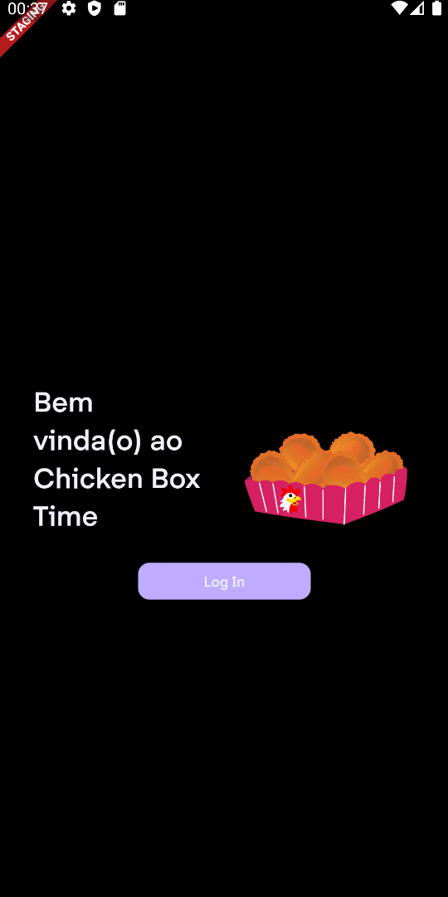
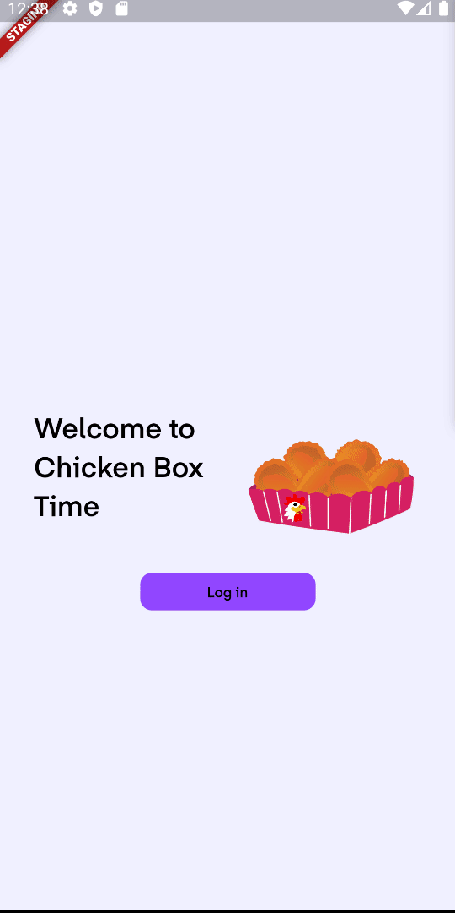

# Chicken Box Time 🍗🎬
<!-- show case/gif section -->

<p align="center">
  
  <br/>
</p>

<!-- show case/gif section END -->

<!-- about app and course section -->

---

## About this App 🗣

In this app, it is possible to you find information about the next movie you're going to watch in the company of a nice Chicken Box and of course, having a good time!
<br/>

This App has some features such as:


Internationalization (i10n)            | Dark/Light mode             | And more!             |
:-------------------------:|:-------------------------:|:-------------------------:
   |  |  

> 💡 The Search feature considers both **title** and **description** of the movie.

This project has a simple CI pipeline, to analyze the code and run the unit and widget tests.
<br/>
For more information, check the [ci.yaml](https://github.com/samuelematias/chicken_box_time/blob/main/.github/workflows/ci.yml) file, which has the whole process in detail, step by step.
  
---

## Running the project locally 🔨

1. Clone this repository into your machine:

```bash
git clone https://github.com/samuelematias/chicken_box_time.git
```
2. With the repository cloned, open the repository root in your terminal and run the command:

```bash
flutter pub get
```
With FVM:

```bash
fvm flutter pub get
```
3. Everything working fine, without any errors, run the app with the following command:

```bash
flutter run
```
With FVM:

```bash
fvm flutter run
```

4. Have fun!

---

## Flavor's 🍨

- [x] Android
- [x] iOS
- [ ] macOS - **Soon**!

Flavor Development             | Flavor Staging             | Flavor Production             |
:-------------------------:|:-------------------------:|:-------------------------:
 |  | 

### For building `development` environment :

```sh
flutter run --flavor development -t lib/main_development.dart
```

### For building `staging` environment :

```sh
flutter run --flavor staging -t lib/main_staging.dart
```

### For building `production` environment :

```sh
flutter run --flavor production -t lib/main_production.dart
```
### Run Flavor's in debug mode

In VsCode, add this config in your `.vscode/launch.json`:

```json
{
    "version": "0.2.0",
    "configurations": [
        {
            "name": "development",
            "request": "launch",
            "type": "dart",
            "program": "lib/main_development.dart",
            "args": [
                "-t",
                "lib/main_development.dart",
                "--flavor",
                "development"
            ]
        },
        {
            "name": "staging",
            "request": "launch",
            "type": "dart",
            "program": "lib/main_staging.dart",
            "args": [
                "-t",
                "lib/main_staging.dart",
                "--flavor",
                "staging"
            ]
        },
        {
            "name": "production",
            "request": "launch",
            "type": "dart",
            "program": "lib/main_production.dart",
            "args": [
                "-t",
                "lib/main_production.dart",
                "--flavor",
                "production"
            ]
        }
    ]
}
```

---

## Working with Translations 🌐

This project relies on [flutter_localizations][flutter_localizations_link] and follows the [official internationalization guide for Flutter][internationalization_link].

### Adding Strings

1. To add a new localizable string, open the `app_en.arb` file at `lib/l10n/arb/app_en.arb`.

```arb
{
    "@@locale": "en",
    "counterAppBarTitle": "Counter",
    "@counterAppBarTitle": {
        "description": "Text shown in the AppBar of the Counter Page"
    }
}
```

2. Then add a new key/value and description

```arb
{
    "@@locale": "en",
    "counterAppBarTitle": "Counter",
    "@counterAppBarTitle": {
        "description": "Text shown in the AppBar of the Counter Page"
    },
    "helloWorld": "Hello World",
    "@helloWorld": {
        "description": "Hello World Text"
    }
}
```

3. Use the new string

```dart
import 'package:very_good_example_app/l10n/l10n.dart';

@override
Widget build(BuildContext context) {
  final l10n = context.l10n;
  return Text(l10n.helloWorld);
}
```

### Adding Supported Locales

Update the `CFBundleLocalizations` array in the `Info.plist` at `ios/Runner/Info.plist` to include the new locale.

```xml
    ...

    <key>CFBundleLocalizations</key>
	<array>
		<string>en</string>
		<string>pt</string>
	</array>

    ...
```

### Adding Translations

1. For each supported locale, add a new ARB file in `lib/l10n/arb`.

```
├── l10n
│   ├── arb
│   │   ├── app_en.arb
│   │   └── app_pt.arb
```

2. Add the translated strings to each `.arb` file:

`app_en.arb`

```arb
{
    "@@locale": "en",
    "counterAppBarTitle": "Counter",
    "@counterAppBarTitle": {
        "description": "Text shown in the AppBar of the Counter Page"
    }
}
```

`app_pt.arb`

```arb
{
    "@@locale": "pt",
    "counterAppBarTitle": "Contador",
    "@counterAppBarTitle": {
        "description": "Texto mostrado na AppBar da Counter Page"
    }
}
```

---

## Tech Stack 👩🏾‍💻

> 💪 Building with sound null safety 💪

- [Dart - 2.16.2][Dart - 2.16.2]
- [Flutter - 2.10.4][Flutter - 2.10.4]
 
> Aren't you in this Flutter/Dart vesion? Consider taking a look at [FVM][FVM], I believe it can help you at this point 😉.

---

## Packages/Plugins 📟

- [bloc][bloc]
- [bloc_test][bloc_test]
- [build_runner][build_runner]
- [cached_network_image][cached_network_image]
- [equatable][equatable]
- [flutter_bloc][flutter_bloc]
- [flutter_localizations][flutter_localizations]
- [flutter_svg][flutter_svg]
- [go_router][go_router]
- [http][http]
- [intl][intl]
- [json_annotation][json_annotation]
- [json_serializable][json_serializable]
- [lottie][lottie]
- [meta][meta]
- [mocktail][mocktail]
- [modal_bottom_sheet][modal_bottom_sheet]
- [very_good_analysis][very_good_analysis]

---

## Tools 🛠

- [hover][hover]

---

## Next Steps 💼

- [ ] Design System - Tests
- [ ] Movie API - Tests
- [ ] Movie API - Tests
- [ ] Movie API - More Tests
- [ ] Manually change theme/mode (take default by system)
- [ ] Local Storage - Implementation
- [ ] Local Storage - Tests
- [ ] Manually change language
- [ ] Manually change language?
- [ ] Settings page (change theme/language)
- [ ] Infinite scroll
- [ ] Accessibility

---

## Contributors 🚀

<!-- ALL-CONTRIBUTORS-LIST:START - Do not remove or modify this section -->
<!-- prettier-ignore -->
<table>
  <tr>
    <td align="center"><a href="https://twitter.com/samuelematias"><br /><sub><b>Samuel Matias</b></sub></a><br /><a href="https://www.linkedin.com/in/samuelematias/"title="Code">💻</a><a href="https://linktr.ee/samuelematias"title="Design"> 🎨</a></td></td>
</table>

<!-- ALL-CONTRIBUTORS-LIST:END -->

<!-- about app and course section END -->

<!-- Stuffs links -->

[flutter_localizations_link]: https://api.flutter.dev/flutter/flutter_localizations/flutter_localizations-library.html
[internationalization_link]: https://flutter.dev/docs/development/accessibility-and-localization/internationalization
[Dart - 2.16.2]: https://dart.dev/
[Flutter - 2.10.4]: https://flutter.dev/
[FVM]: https://fvm.app/
<!-- Packages/Plugins -->

[bloc]: https://pub.dev/packages/bloc
[bloc_test]: https://pub.dev/packages/bloc_test
[build_runner]: https://pub.dev/packages/build_runner
[cached_network_image]: https://pub.dev/packages/cached_network_image
[equatable]: https://pub.dev/packages/equatable
[flutter_bloc]: https://pub.dev/packages/flutter_bloc
[flutter_localizations]: https://pub.dev/packages/flutter_localizations
[flutter_svg]: https://pub.dev/packages/flutter_svg
[go_router]: https://pub.dev/packages/go_router
[http]: https://pub.dev/packages/http
[intl]: https://pub.dev/packages/intl
[json_annotation]: https://pub.dev/packages/json_annotation
[json_serializable]: https://pub.dev/packages/json_serializable
[lottie]: https://pub.dev/packages/lottie
[meta]: https://pub.dev/packages/meta
[mocktail]: https://pub.dev/packages/mocktail
[modal_bottom_sheet]: https://pub.dev/packages/modal_bottom_sheet
[very_good_analysis]: https://pub.dev/packages/very_good_analysis


[hover]: https://github.com/go-flutter-desktop/hover
